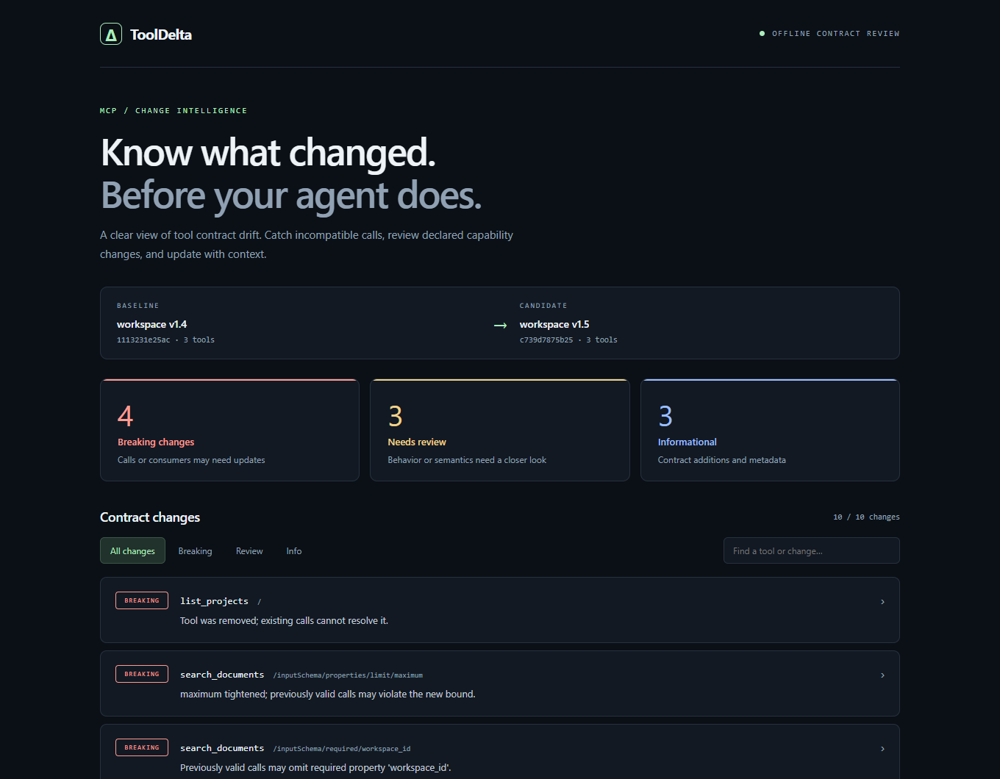

# ToolDelta

**Узнайте, что сломает обновление MCP-сервера, до запуска агента.**

ToolDelta сравнивает сохранённые каталоги `tools/list`, объясняет изменения
контрактов и формирует отчёты для ревью и CI. Нулевые зависимости при запуске,
Python 3.11+, MIT. Работает локально: не запускает MCP-серверы, не вызывает
инструменты и не отправляет данные в сеть.

[English](README.md) · [Исследование рынка](docs/MARKET.ru.md) ·
[Описание коммитов](docs/COMMITS.ru.md) · [Правила проверок](docs/CONTRACTS.md)

[Репозиторий GitHub](https://github.com/arcnosixta/tooldelta) ·
[Проверки CI](https://github.com/arcnosixta/tooldelta/actions/workflows/ci.yml)

**[Попробовать в браузере](https://arcnosixta.github.io/tooldelta/)** — пример,
реальное обновление сервера или сравнение своих каталогов без установки.

[Короткая запись работы](https://arcnosixta.github.io/tooldelta/demo.webm).



## Запуск без установки

Из папки проекта:

```powershell
python -m mcp_tooldelta demo
python -m mcp_tooldelta demo --format html -o reports/demo.html --fail-on none
```

Откройте `reports/demo.html`. Готовый пример уже находится в
[docs/assets/demo.html](docs/assets/demo.html); для просмотра в GitHub понадобится
скачать файл или клонировать репозиторий. HTML открывается как обычный локальный
файл, работает без сервера, внешних шрифтов и интернета.

В демонстрации **4 breaking, 3 review, 3 info**: удалён инструмент, уменьшен лимит,
добавлен обязательный `workspace_id`, расширен enum ответа и изменены подсказки
поведения `read_file`. Фильтры и поиск помогают найти нужный инструмент,
раскрывающиеся строки показывают значения до/после и следующий шаг для ревьюера.

Обычная команда `demo` специально возвращает код **1**: пример содержит изменения,
которые блокируют проверку. Для просмотра без блокирования используйте
`--fail-on none`.

## Установка и реальные данные

```powershell
python -m pip install .
mcp-tooldelta --version
mcp-tooldelta snapshot captured-tools.json -o baseline.json
mcp-tooldelta diff baseline.json candidate.json
mcp-tooldelta diff baseline.json candidate.json --format html -o reports/review.html
```

Установка может скачать сборщик пакета. Сама утилита не нуждается в сети.
На PyPI этот проект не опубликован, совпадение имени пакета не подтверждает его
принадлежность проекту.

В версии 0.2 пакет и команда называются **`mcp-tooldelta`**, Python-модуль —
**`mcp_tooldelta`**. Имя `tooldelta` на PyPI занято другим проектом; его установка
не установит эту утилиту. Для обновления с локальной версии 0.1 используйте
новое виртуальное окружение. Готовый wheel доступен в
[GitHub Releases](https://github.com/arcnosixta/tooldelta/releases/latest).

## Демо и реальный кейс

В онлайн-демо можно загрузить два полных каталога. Сравнение выполняет тот же
Python-код, что и CLI, в отдельном потоке браузера через Pyodide 0.29.3. Содержимое
файлов не отправляется на сервер; при первом запуске скачивается Python-runtime
с jsDelivr. Аналитики, регистрации и серверного хранения нет.

Для официального MCP Filesystem Server 2025.1.14 → 2026.8.31 обнаружено изменение:
у `read_multiple_files.paths` появился `minItems: 1`. Старый каталог допускал
пустой массив, новый требует хотя бы один путь. Всего в отчёте 1 breaking,
45 review, 41 info; это количество замечаний о контрактах и метаданных,
а не число уязвимостей. Источники, версии зависимостей и лицензии сохранены в
[реальном примере](examples/filesystem/README.md). Файловые инструменты не вызывались.

## Входные данные

Сохраните полные ответы `tools/list` из своего MCP-клиента или интеграционных
тестов до и после обновления. ToolDelta не получает их автоматически.
При пагинации объедините все страницы и удалите `nextCursor`; частичные каталоги
отклоняются, чтобы не принять недостающую страницу за удаление инструментов.
Сравнивайте один сервер за раз, имена инструментов должны быть уникальными.

Поддерживаются массив инструментов, объект `tools` и оболочка JSON-RPC
`result.tools`. В корне inputSchema и outputSchema требуется `type: object`.
Файлы — UTF-8, максимум 8 МиБ и 64 уровня вложенности. Дублирующиеся имена и
JSON-ключи запрещены. Повторная запись отчёта требует `--force`; входной каталог
перезаписать нельзя.

## Что проверяется

- Удаление и добавление инструментов.
- Типы, enum/const, обязательность полей и вложенные объекты/массивы.
- Границы чисел, строк, массивов и количества свойств, uniqueItems.
- Политика дополнительных свойств.
- outputSchema с обратным направлением совместимости.
- Описания и annotations: изменения для ревью, а не доказательство реальных прав.

Сужение входа опасно: прежний вызов может стать недопустимым. Расширение ответа
опасно для старого потребителя: он может не знать новое значение или тип.
Неизвестные ограничения — `$ref`, `oneOf`, `pattern`, `format`, `multipleOf` и
другие — требуют ручного ревью, даже когда текст схемы не изменился.

Это альфа-версия для проверки контрактов, а не полный валидатор JSON Schema и не
сертификат безопасности. Проверки отдельных ограничений консервативны и могут
дать лишнее замечание при избыточных или противоречивых условиях. Отчёт содержит
значения схем: перед отправкой проверьте, нет ли чувствительных данных в defaults,
examples или описаниях.

## Коды для CI

| Код | Значение |
| --- | --- |
| 0 | Нет замечаний на уровне выбранного порога или выше |
| 1 | Есть замечания на уровне порога или выше; отчёт сформирован |
| 2 | Ошибка входных данных, аргументов или записи |

По умолчанию `--fail-on review` блокирует breaking и review.
`--fail-on breaking` пропускает review, `--fail-on info` блокирует любое замечание,
`--fail-on none` только создаёт отчёт. Порог не скрывает замечания.

Форматы: `text`, `json`, `markdown`, `html`. В GitHub Actions загружайте отчёт
даже при падении проверки; [пример интеграции](docs/CI.md).

## Проверки проекта

```powershell
python -m unittest discover -v
```

29 тестов, включая направление input/output, некорректный JSON, неизвестные
ограничения, кодировку, CLI и защиту отчёта от HTML-инъекции. Для проверки в
настоящем браузере установите Playwright как зависимость разработки и запустите
`scripts/check_report.py`; [инструкция](CONTRIBUTING.md).

GitHub Actions подготовлен для Windows, Linux и macOS, Python 3.11 и 3.14;
локально проверяется Windows / Python 3.12. Количество звёзд не гарантируется.
Обоснование выбора направления и план проверки спроса — в
[исследовании рынка](docs/MARKET.ru.md).
